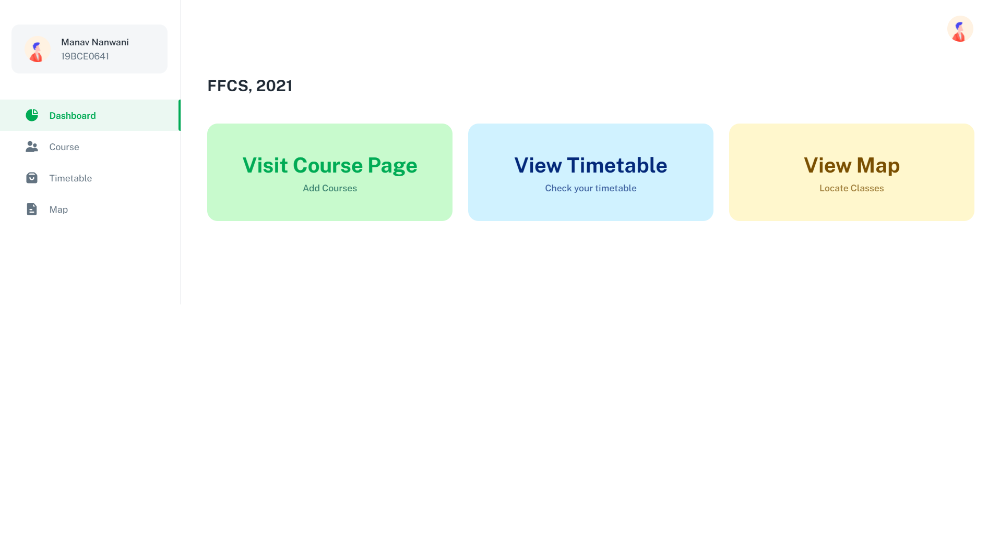

## Submission for MotorQ Application Enginner

## Recorded Video

<a href="https://drive.google.com/file/d/1htKN__Mm_uAoeRo1gzlTz51BSVX1v6ri/view?usp=sharing" target="_blank"><strong>Link »</strong></a>

## Getting started

- Recommended `node js 14+` and `npm 6+`
- Clone this repo: `git clone https://github.com/manavnanwani/MotorQ-FFCS.git`
- Install dependencies: `npm install` in both client and server directory
- Start the server: `npm run start` in both client and server directory
