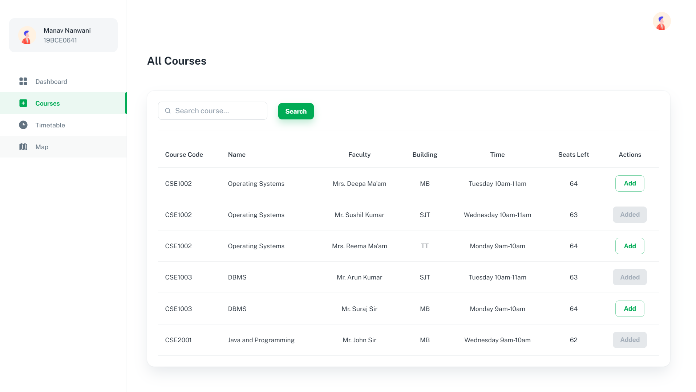
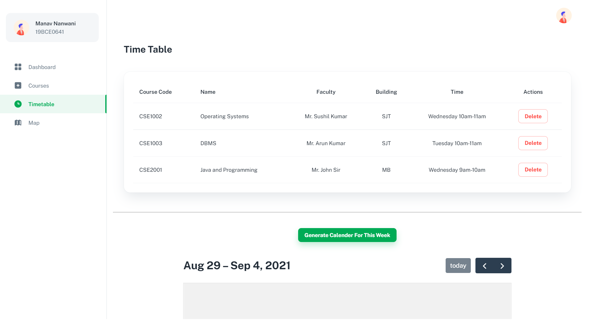
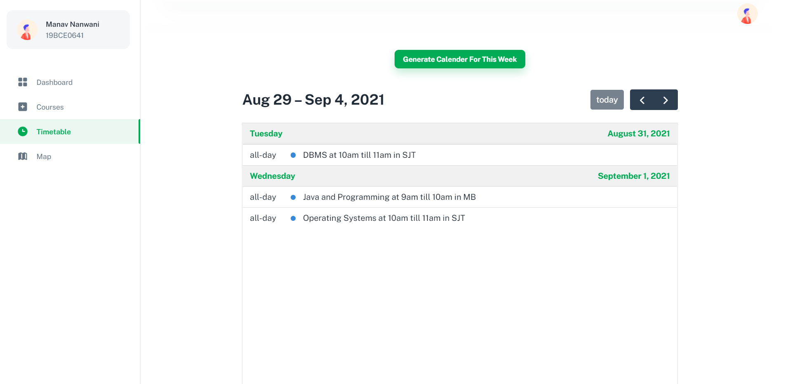
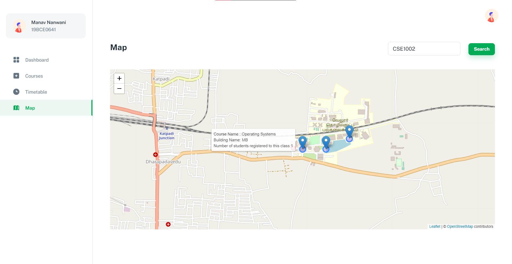

## Submission for MotorQ Assignment in the Application Engineer Track

## Recorded Video

<a href="https://drive.google.com/file/d/1nT9qGjB-DKRZZJM7bAp2By9g3mo9tNU0/view?usp=sharing" target="_blank"><strong>Link »</strong></a>

## Getting started

- Recommended `node js 14+` and `npm 6+`
- Clone this repo: `git clone https://github.com/manavnanwani/MotorQ-FFCS.git`
- Install dependencies: `npm install` in both client and server directory
- Start the server: `npm run start` in both client and server directory

## Features

- Search and Add Courses.
- View registered courses and delete them.
- Locate all the classes of a particular subject on a map.

## Additional Features

- View number of students who have registered for a subject under a particular teacher.
- Generate current week's timetable on a calender.

## Tools and Languages Used:

## Features and Interfaces

1. Dashboard

   - Dashboard with tabs to navigate to other pages.

   - 

2. Course Page

   - Search and Add your course and prefered teacher.

   - 

3. Time table

   - List of all the registered courses. You can delete a specific course if you change your mind.

   - 

   - On generating the calender, current week's timetable is displayed with all neccessary details.

   - 

4. Map Page

   - Find all the classes of a specific course and locate the building in which the classes would be taken.

   - 
